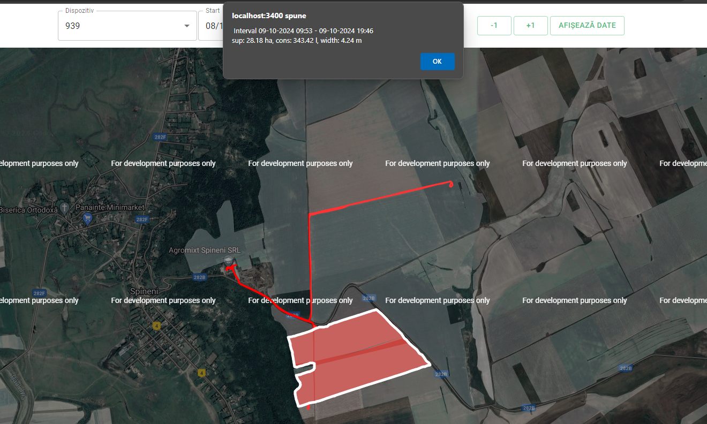

Documentație tehnică pentru agroTestSurfaceView

1. Introducere

   1.1 Scopul documentație
   Această documentație are ca scop detalierii contrucției și modului de funcționare a uneltei agroTestSurfacesView. Documentul este destinat dezvoltatorilor care doresc să folosească această aplicație împreună cu serviciul agroBackEnd

   1.2 Prezentarea uneltei
   Unealta afișează pe o hartă Google maps datele care parvin din backEnd în urma solicitării de tip getPath. Aceste date pot fi linii (traseu sau segmente), poligoane (lucrări) sau puncte (diverse puncte necesare procesului de îmbunătățire). Logarea într-un cont se face automat în funcție de datele care sunt salvate în .env. În funcție de contul logat lista de dispozitive este personalizată.

2. Descriere generală

   2.1 Funcționalități cheie
   2.1.1 - Preluarea datelor despre traseu din anumite intervale de timp - pentru afișarea se poate alege dispozitivul, data și ora de început precum și data și ora de sfârșit. Suplimentar există o acțiune rapidă pentru a muta intervalul de selecție cu o zi înainte sau în urmă.
   2.1.2 - Afișarea datelor primite pe hartă: poligoane, linii și puncte - în funcție de intervalul și dispozitivul țintă ales
   2.1.3 - Interacțiunea cu poligoanele afișate prin click - un poligon reprezintă o suprafață lucrată determinată care conține mai multe informații despre intervalul lucrării, suprafața lucrată (ha), consumul de carburant(l) și lățimea de lucru(m) ce sunt afișate într-o fereastră de alertă la selectarea prin click a unui poligon
   

3. Beneficii

   3.1 - Vizualizarea rapidă pe o hartă traseului, a poligoanelor lucrărilor determinate și a elementelor ajutătoare (segmente, puncte, etc. );
   3.1 - Selecție rapidă pe un interval și un dispozitiv pentru a evalua capacitate de determinare a aloritmului.
   3.1 - Afișarea parcelelor APIA pe harta Google Maps pentru o mai bună contextualizare a celorlalte date

4. Instalare

   4.1 Cerințe de sistem

   4.1.1 - Specificații hardware - OS Linux / Windows / Macos, minim 1Gb de RAM și 10 Mb spațiu de stocare

   4.1.2 - Dependințe neceare - NodeJs + NPM + Git

   4.2 Descărcare și rulare

   - Se clonează repo-ul local
   - Se instalează prin npm ci toate dependințelete
   - Se adaugă următoarele variabile în fișierul .env din rădăcina proiectului
     - username=[utilizator]
     - password=[parola]
     - server=[adresaServerului]
