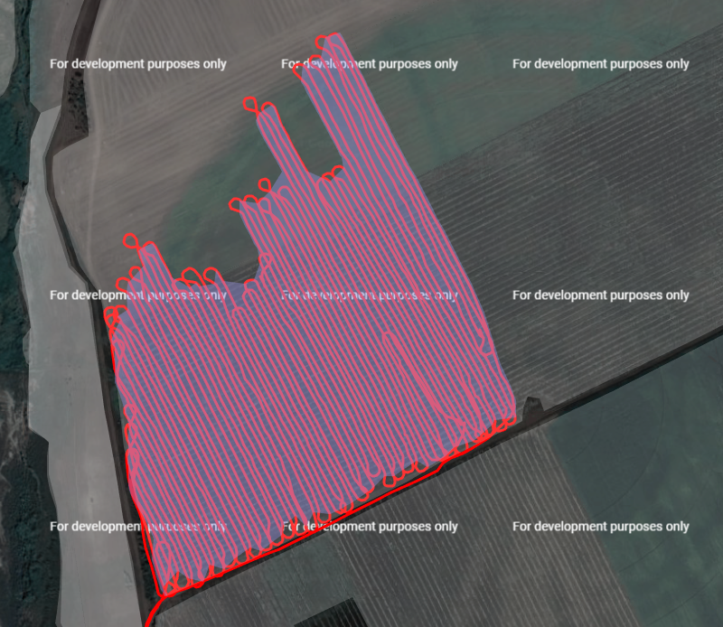

# <p align="center">**Documentație Tehnică pentru agroTestSurfaceView**</p>

---

## **1. Introducere**

### **1.1 Scopul documentației**

Această documentație detaliază construcția și modul de funcționare al uneltei **agroTestSurfaceView**. Este destinată dezvoltatorilor care doresc să utilizeze această aplicație împreună cu serviciul **agroBackEnd**.

### **1.2 Prezentarea uneltei**

**agroTestSurfaceView** este o aplicație care afișează pe o hartă Google Maps datele primite de la serviciul back-end în urma solicitărilor de tip `getPath`. Aceste date includ:

- **Linii**: trasee sau segmente de deplasare.
- **Poligoane**: lucrări agricole determinate.
- **Puncte**: diverse puncte necesare pentru ajustarea algoritmilor.

Autentificarea se realizează automat pe baza datelor salvate în fișierul `.env`. Lista de dispozitive afișată este personalizată în funcție de contul conectat.

---

## **2. Descriere generală**

### **2.1 Funcționalități cheie**

- **Preluarea datelor pe intervale de timp**:

  - **Selectarea dispozitivului și a intervalului de timp**: Permite alegerea dispozitivului, a datei și orei de început, precum și a datei și orei de sfârșit pentru afișarea datelor relevante.
  - **Navigare rapidă**: Funcție care permite mutarea intervalului de selecție cu o zi înainte sau înapoi pentru o analiză rapidă.

- **Afișarea datelor pe hartă**:

  - **Vizualizare interactivă**: Afișează poligoane, linii și puncte pe harta Google Maps în funcție de selecțiile realizate.

- **Interacțiunea cu poligoanele**:

  - **Detalii lucrare**: Prin clic pe un poligon, se afișează o fereastră cu informații detaliate, inclusiv:
    - Intervalul de timp al lucrării.
    - Suprafața lucrată (în hectare).
    - Consum de carburant (în litri).
    - Lățimea de lucru (în metri).


---

## **3. Beneficii**

### **3.1 Vizualizare rapidă și eficientă**

- **Trasee și lucrări**: Permite vizualizarea imediată a traseelor parcurse și a poligoanelor lucrărilor determinate, facilitând analiza și monitorizarea activităților agricole.

  

- **Elemente ajutătoare**: Afișează segmente și puncte suplimentare pentru o analiză detaliată și pentru îmbunătățirea algoritmilor de determinare.

  

- **Contextualizare**: Integrează parcelele APIA pe harta Google Maps pentru o înțelegere mai bună a datelor în contextul real.

### **3.2 Transmiterea rapidă de elemente vizuale din back-end**

- **Variabile globale**: În **agroBackEnd** există două variabile globale, `mapShowPoints` și `mapShowSegments`. Orice punct sau segment adăugat în aceste variabile va fi afișat pe hartă.
- **Flexibilitate**: Aceste variabile pot fi accesate și modificate din orice componentă a back-end-ului, permițând o afișare rapidă a acestor elemente în Google Maps.

---

## **4. Instalare**

### **4.1 Cerințe de sistem**

- **Specificații hardware**:

  - **Sistem de operare**: Linux, Windows sau macOS.
  - **Memorie RAM**: Minim 1 GB.
  - **Spațiu pe disc**: Minim 10 MB liber.

- **Dependențe necesare**:

  - **Node.js** și **npm**: Pentru gestionarea pachetelor și rularea aplicației.
  - **Git**: Pentru clonarea repository-ului.

### **4.2 Descărcare și instalare**

- **Clonarea repository-ului**:

  Clonați repository-ul folosind comanda:

  ```bash
  git clone [adresa_repo]
  ```

  Înlocuiți `[adresa_repo]` cu URL-ul repository-ului.

- **Instalarea dependențelor**:

  Navigați în directorul proiectului și instalați dependențele cu:

  ```bash
  npm ci
  ```

- **Configurarea variabilelor de mediu**:

  Creați un fișier `.env` în directorul rădăcină al proiectului și adăugați următoarele variabile:

  ```env
  username=[utilizator]
  password=[parola]
  server=[adresaServerului]
  ```

  Înlocuiți `[utilizator]`, `[parola]` și `[adresaServerului]` cu informațiile corespunzătoare contului și serverului dvs.

- **Rularea aplicației**:

  Porniți aplicația folosind comanda:

  ```bash
  npm run start
  ```

---

## **5. Utilizare**

După ce aplicația este rulată, accesați-o în browser la adresa specificată (implicit `http://localhost:3400`). În interfață, puteți:

- **Selecta dispozitivul**: Alegeți din lista personalizată de dispozitive asociate contului dvs.
- **Seta intervalul de timp**: Selectați data și ora de început și de sfârșit pentru a afișa datele dorite.
- **Vizualiza datele**: Datele relevante vor fi afișate pe hartă, permițând interacțiunea și analiza acestora.

---

## **6. Exemple de utilizare**

### **6.1 Afișarea unei lucrări cu suprafață mare**

Acest exemplu prezintă o lucrare agricolă pe o distanță lungă și cu o suprafață mare lucrată.


### **6.2 Afișarea mai multor suprafețe lucrate fără ghidaj**

Ilustrează situația în care se lucrează fără un ghidaj clar, rezultând mai multe suprafețe lucrate cu capete neuniforme.



### **6.3 Afișarea unei suprafețe cu iregularități pe margini**

Prezintă o suprafață lucrată care prezintă iregularități semnificative pe margini, evidențiind necesitatea ajustării algoritmilor.


---
